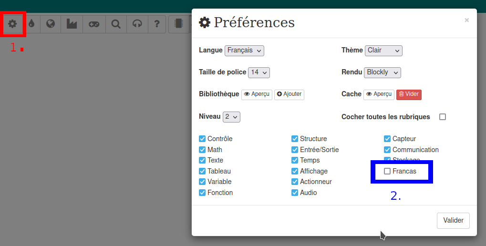
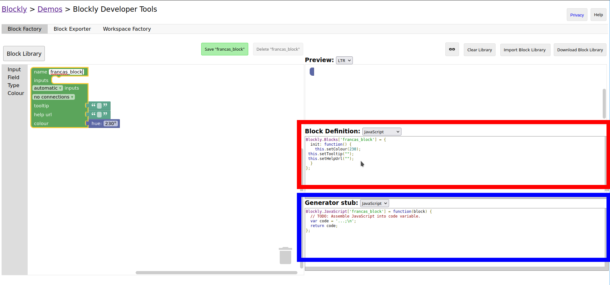

# Personnalisation du projet Blocklino

Ce guide permet de définir la procédure pour personnaliser ce fork du projet Blocklino, à savoir ajouter des blocs, des
boîtes à outils et permettre à ces composants d'envoyer du code à une carte arduino. Ces instructions sont spécifiques
au projet actuel et servent de mémo pour faciliter sa personnalisation, dans le cadre des missions réalisées par les
Francas de Seine-Maritime.

À titre d'exemple, Une catégorie nommée `francas_category` a été ajoutée à la boîte à outils, ainsi qu'un bloc nommé
`francas_block`. Ils servent de modèle pour la création de nouveaux blocs et devraient être supprimés pour la mise en
production.

Si vous êtes débutant avec ce projet, lisez le guide de [Blockly](https://developers.google.com/blockly/guides/overview)
et de [Blocklino](../README.md) pour avoir un guide faisant le tour des principaux concepts de ces projets. Les notions de
programmation en bloc, toolbox, workpace ou autres demandent à être comprises pour suivre ce guide, et ne seront pas
redéfinies ici.

## Ajout d'une nouvelle catégorie à la boîte à outils

La boîte à outils par défaut utilisée par le projet est dans le fichier
[`www/toolbox/toolbox_arduino_all.xml`](../www/toolbox/toolbox_arduino_all.xml). Chaque nouvelle catégorie doit être placée dans ce
fichier, entre les balises `<toolbox>` et `</toolbox>`.

Une catégorie a la syntaxe suivante :

 ```xml

<category name="francas_category" colour="#ff8000">
    <block type="francas_block1"></block>
    <block type="francas_block2"></block>
    <!---etc.-->
</category>
 ```

**Attention à ne pas mettre d'espace dans le nom d'un bloc ou d'une catégorie !**

Pour personnaliser le nom de notre catégorie (celui affiché à l'utilisateur), il faut ajouter la variable
`Blockly.Msg.francas_category= "Catégorie Des Francas";` dans le fichier [`www/lang/msg_fr.js`](../www/lang/msg_fr.js).

**Si la catégorie n'apparaît pas au chargement du site, il se peut que vous deviez l'activer dans les préférences comme
suit :**


## Création d'un bloc

Le code décrivant un bloc a 3 composantes :

- La déclaration du bloc dans la boîte à outils : Elle permet de rendre visible le bloc dans la catégorie de son choix.
- La déclaration de l'interface utilisateur du bloc : L'apparence et toutes les possibilités d'interaction de
  l'utilisateur avec le bloc :
    - Sa couleur.
    - Ses éléments descriptifs (textes, images, etc).
    - Ses paramètres (entrées de valeurs, déclarations d'autres blocs, etc)
- Le générateur de code associé au bloc : Le composant chargé de traduire l'interface du bloc en code exécutable par une
  carte Arduino, en prenant en compte les paramètres de l'utilisateur.

### Création de l'interface du bloc

Pour faciliter l'écriture du code définissant le comportement de notre bloc, nous pouvons utiliser l'outil Blockly
Factory, disponible [en ligne](https://blockly-demo.appspot.com/static/demos/blockfactory/index.html) ou
[en local](../www/factory.html).


Exemple de déclaration de bloc :

```js
Blockly.Blocks['francas_block'] = {
  init: function() {
    this.appendDummyInput()
        .setAlign(Blockly.ALIGN_CENTRE)
        .appendField("Francas Bloc")
        .appendField(
            new Blockly.FieldImage("https://www.bafa-lesfrancas.fr/sites/default/files/2017-08/logo-francas_0.png",
            100, 50, { alt: "*", flipRtl: "FALSE" }));
    this.appendDummyInput()
        .appendField("Un bloc pour faire des tests");
    this.appendDummyInput()
        .appendField("Faire clignoter la led de la carte ")
        .appendField(new Blockly.FieldTextInput("3"), "nbBlinks")
        .appendField(" fois.");
    this.setPreviousStatement(true, null);
    this.setNextStatement(true, null);
    this.setColour(30);
 this.setTooltip("");
 this.setHelpUrl("");
  }
};
```

### Ajout du bloc au projet

Une fois le bloc créé, différents morceaux de code sont à insérer dans le projet de la manière suivante :

- Le code dans la zone en **rouge**, celui de définition du bloc, doit être mis dans le fichier
  [`www/blocs&generateurs/arduino_blocs.js`](../www/blocs&generateurs/arduino_blocs.js).
- Le code dans la zone en **bleu**, celui qui génère le code à envoyer à la carte Arduino en fonction des paramètres du
  bloc, doit être mis dans le fichier
  [`www/blocs&generateurs/blockly_generateurs_cpp.js`](../www/blocs&generateurs/blockly_generateurs_cpp.js).
- La ligne `<block type="francas_block1"></block>` doit être ajoutée dans le fichier
  [`www/toolbox/toolbox_arduino_all.xml`](../www/toolbox/toolbox_arduino_all.xml), au sein de la catégorie voulue.

### Personnalisation du générateur de code

Nous travaillons avec une version de Blockly adaptée à Arduino. Cela implique certaines modifications dans le code.
Modifiez la première ligne du générateur de la manière suivante :

```diff
-   Blockly.JavaScript['francas_block'] = function(block) {
+   Blockly.Arduino['francas_block'] = function(block) {
```

Le générateur de code est une fonction qui retourne une variable de type `String` dont le contenu est le code écrit en
C/C++, à destination de la carte Arduino.

Par exemple, pour générer le code en C `printf("hello world!");`, la fonction aura le corps suivant :

```js
Blockly.Arduino['francas_block'] = function(block) {
  var code = "printf(\"hello world\");" 
  return code;
};
```

Le générateur de code doit être ajouté dans le
fichier [www/blocs&generateurs/blockly_generateurs_cpp.js](../www/blocs&generateurs/blockly_generateurs_cpp.js).

Se référer au guide de Blockly donné au début du document pour avoir toutes les informations sur la façon de récupérer
la valeur des paramètres du bloc.
