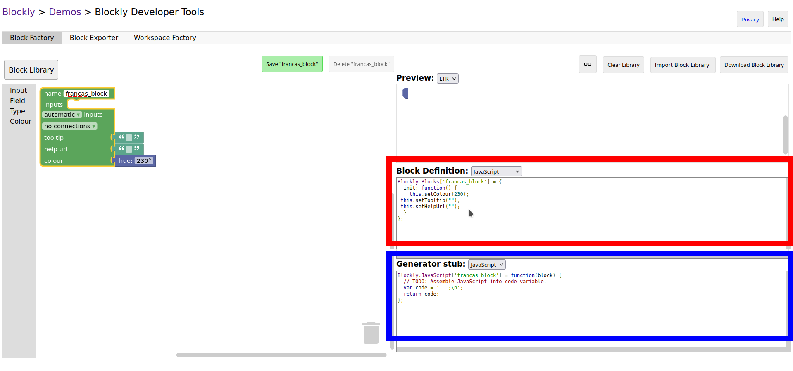

# Personnalisation de Blocklino
Ce guide permet de définir la procédure pour personnaliser ce projet Blocklino, à savoir ajouter des blocs, des boîtes à outils et permettre à ces composants d'envoyer du code à une carte arduino via les générateurs de code.
Pour avoir un guide complet de la configuration de Blockly, rendez-vous [ici](https://developers.google.com/blockly/guides/overview).
## Personnalisation de la boîte à outils
La boîte à outils par défaut utilisée par le projet est dans le fichier [`toolbox/toolbox_arduino_all.xml`](toolbox/toolbox_arduino_all.xml). chaque nouvelle catégorie doit être placée dans ce fichier, entre les balises `<toolbox>` et `</toolbox>`. Une catégrie a la suntaxe suivante:
 ```xml
<category name="francas_category" colour="#ff8000">
    <block type="francas_block"></block>
</category>
 ```
## Création d'un bloc
Pour faciliter l'écriture du code définissant le comportement de notre bloc, nous pouvons utiliser l'outil Blockly Factory, disponible [en ligne](https://blockly-demo.appspot.com/static/demos/blockfactory/index.html) ou [en local](www/factory.html).

Une fois le bloc crée, différents morceaux de code sont à insérer dans le projet de la manière suivante:
 - Le code dans la zone en rouge, celui de définition du bloc, doit être mis dans le fichier [`blocs&generateurs/arduino_blocs.js`](blocs&generateurs/arduino_blocs.js) .
 - Le code dans la zone en bleu, celui qui génère le code à envoyer à la carte arduino en fonction des paramètres du bloc,  doit être mis dans le fichier [`blocs&generateurs/blockly_generateurs_cpp.js`](blocs&generateurs/blockly_generateurs_cpp.js).
